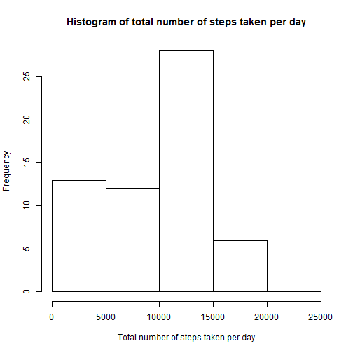
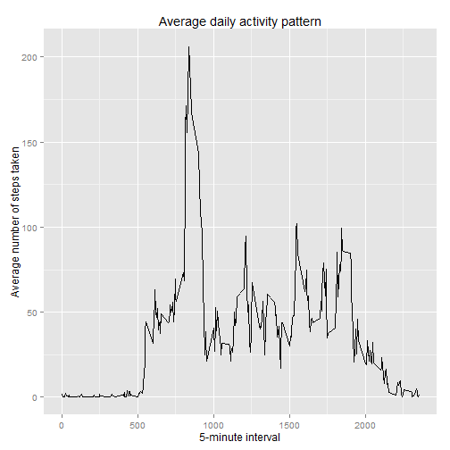
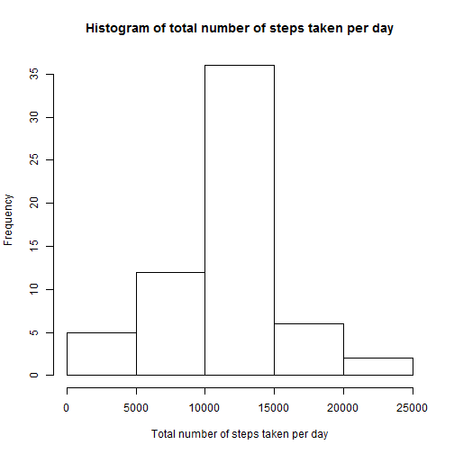
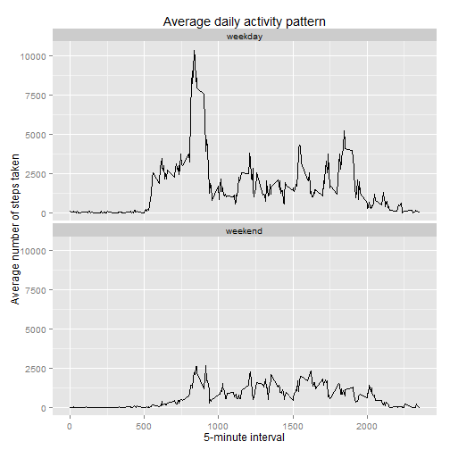

## Introduction

This assignment makes use of data from a personal activity monitoring device using activity monitoring devices, such as a Fitbit (http://www.fitbit.com), Nike Fuelband (http://www.nike.com/us/en_us/c/nikeplus- fuelband), or Jawbone Up (https://jawbone.com/up). This device collects data at 5 minute intervals through out the day. The data consists of two months of data from an anonymous individual collected during the months of October and November, 2012 and include the number of steps taken in 5 minute intervals each day.

## Data details

The data for this assignment was downloaded from the course web site: Activity monitoring data (https://d396qusza40orc.cloudfront.net/repdata%2Fdata%2Factivity.zip) [52K] The dataset is stored in a comma-separated-value (CSV) file and there are a total of 17,568 observations in this dataset.

The variables included in this dataset are:

- steps: Number of steps taking in a 5-minute interval (missing values are coded as NA )
- date: The date on which the measurement was taken in YYYY-MM-DD format
- interval: Identifier for the 5-minute interval in which measurement was taken


### Loading the activity monitoring data


```r
## package ggplot2 would be required to execute the code
library(ggplot2)
```

```
## Warning: package 'ggplot2' was built under R version 3.1.2
```

```r
## download the data from the above mentioned URL and unzip it.
## set the working directory as the folder which holds the "activity.csv" file
## Load the activity monitoring data
steps_movement <- read.csv("activity.csv")
```


### Exploring the data with mean and median for total number of steps taken per day

As of now we would be the ignoring missing values in the dataset.
Now we will explore the data with total steps per day along with graphical representation of the distribution of data.


```r
## total number of steps taken per day
steps_perday <- aggregate(steps_movement["steps"], by = steps_movement[c("date")], FUN = sum, na.rm= TRUE)
## plot a histogram of the total number of steps taken each day
hist(steps_perday$steps, main="Histogram of total number of steps taken per day", xlab="Total number of steps taken per day")
```

 

```r
## calculate the mean of the total number of steps taken per day
mean(steps_perday$steps)
```

```
## [1] 9354.23
```

```r
## calculate the median of the total number of steps taken per day
median(steps_perday$steps)
```

```
## [1] 10395
```

### Exploring data for daily activity pattern

Now we will explore the data with activity across intervals. This will help us identify the active intervals across all days.

```r
## mean steps taken per interval across all days
steps_perinterval <- aggregate(steps_movement["steps"], by = steps_movement[c("interval")], FUN = mean, na.rm= TRUE)
## plot data for 5-minute interval (x-axis) and the average number of steps taken, averaged across all days (y-axis)
ggplot(data = steps_perinterval, aes(x=interval, y = steps))+geom_line() + xlab("5-minute interval")+ylab("Average number of steps taken") + ggtitle("Average daily activity pattern")
```

 

Now we will identify the most active interval

```r
## show the interval with maximum number of steps
steps_perinterval[which.max(steps_perinterval$steps),1]
```

```
## [1] 835
```

## Imputing missing values

There are a number of days/intervals where there are missing values (coded as NA ). The presence of missing days may introduce bias into some calculations or summaries of the data.

Total number of missing values in the dataset (i.e. the total number of rows with NA s)

```r
## total number of missing values in the dataset
sum(is.na(steps_movement$steps))
```

```
## [1] 2304
```

We would be replacing the NAs with mean for that 5-minute interval. Replacing NAs with mean/median for that day would not be appropriate as early morning and night hours would be most inactive time. Hence replacing NAs with mean for that interval would be appropriate.


```r
## create a set of imputed values for all entries
mean_steps_perinterval <- aggregate(steps_movement["steps"], by = steps_movement[c("interval")], FUN = mean, na.rm= TRUE)
## merge to add an imputed column to the whole data set
steps_movement <- merge(steps_movement, mean_steps_perinterval, by="interval")
## use subsetting to replace the NA values with the imputed
steps_movement$steps.x[is.na(steps_movement$steps.x)]  <- steps_movement$steps.y[is.na(steps_movement$steps.x)]

## total number of steps taken per day along with imputed data
imputed_steps_perday <- aggregate(steps_movement["steps.x"], by = steps_movement[c("date")], FUN = sum, na.rm= TRUE)
## plot a histogram of the total number of steps taken each day along with imputed data
hist(imputed_steps_perday$steps.x, main="Histogram of total number of steps taken per day", xlab="Total number of steps taken per day")
```

 

Now calculating the mean and median with the new data withour NAs.

```r
## mean of total number of steps taken per day along with imputed data
mean(imputed_steps_perday$steps.x)
```

```
## [1] 10766.19
```

```r
## median of total number of steps taken per day along with imputed data
median(imputed_steps_perday$steps.x)
```

```
## [1] 10766.19
```
Without NAs the mean and median are same. These values are close to the earlier median, while the mean has increased from earlier mean.

## Exploring activity patterns between weekdays and weekends

We will add a new factor variable in the dataset with two levels - "weekday" and "weekend" indicating whether a given date is a weekday or weekend day. Then we will plot a time series plot (i.e. type = "l" ) of the 5-minute interval (x-axis) and the average number of steps taken is constructed, averaged across all weekday days or weekend days (y-axis)


```r
## add a new factor variable in the dataset with two levels - "weekday" and "weekend" indicating whether a given date is a weekday or weekend day.
steps_movement$day <- ifelse(weekdays(as.Date(steps_movement$date)) %in% c("Saturday", "Sunday"), "weekend", "weekday")
## mean steps taken per interval across all days along with imputed data
imputed_steps_perinterval <- aggregate(steps_movement["steps.x"], by = steps_movement[c("interval", "day")], FUN = sum, na.rm= TRUE)
## plot data for 5-minute interval (x-axis) and the average number of steps taken, averaged across all weekday days or weekend days (y-axis)
ggplot(data = imputed_steps_perinterval, aes(x=interval, y = steps.x))+geom_line() + xlab("5-minute interval")+ylab("Average number of steps taken") + ggtitle("Average daily activity pattern")+ facet_wrap(~day , ncol=1)
```

 
